# cnn-phys-reproducibility

This repository is the supplementary material of the article **"On the reproducibility of fully convolutional neural networks for modeling time-space evolving physical systems"**, Gonçalves Pinto et al. 2021 - [http://arxiv.org/abs/2105.05482](http://arxiv.org/abs/2105.05482)

It contains the complete description of the neural network and of the computing environement, used code, and samples of hidden layers and the estimated fields.

Abstract:

> Reproducibility of a deep-learning fully convolutional neural network is evaluated by training several times the same network on identical conditions (database, hyperparameters, hardware) with non-deterministic Graphics Processings Unit (GPU) operations. The propagation of two-dimensional acoustic waves, typical of time-space evolving physical systems, is studied on both recursive and non-recursive tasks. Significant changes in models properties (weights, featured fields) are observed. When tested on various propagation benchmarks, these models systematically returned estimations with a high level of deviation, especially for the recurrent analysis which strongly amplifies variability due to the non-determinism. Trainings performed with double floating-point precision provide slightly better estimations and a significant reduction of the variability of both the network parameters and its testing error range.

Repository is organized as follows:

- [images](./images): folder containing the figures shown on this page
- [network](./network): implementation of the neural network, train and testing scripts
- [simulation](./simulation): code for the generation of the database using Palabos

More details are availble in the subfolders

**Disclaimer**: code presented here is not the exact same version used to produce the results shown in the article, some auxiliary or unused features were removed or simplified in order increase its comprehensibility and facilitate the execution by others. Core functionalities remain untouched.

Network architecture
------------

Neural network is multi-scale (field dimensions of N, N/2 and N/4), composed by 17 two-dimensional convolution operations, for a total of 422,419 trainable parameters. ReLUs are used as activation function and replication padding is used to maintain layers size unchanged inside each scale.

  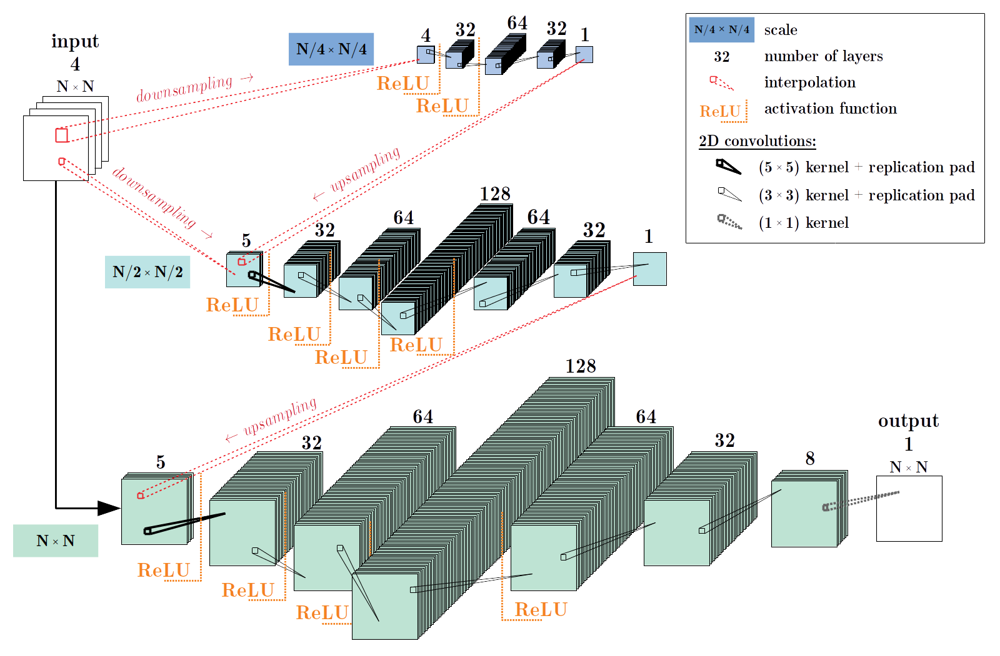

Computing environment
------------

Hardware and versions of the software used in the study are listed below:

+ CPU: Intel® Xeon® Gold 6126 Processor 2.60 GHz
+ GPU: Nvidia Tesla V100 32Gb, Nvidia GPU Driver Version 455.32
+ Software: [Python](https://www.python.org/) 3.8.5, [PyTorch](https://pytorch.org/) 1.7.0, [pytorch-lightning](https://www.pytorchlightning.ai/) 1.0.1, [numpy](https://numpy.org/) 1.19.2 and [CUDA](https://developer.nvidia.com/cuda-toolkit) 11.1

Convergence of trainings
------------

Evolution of the training loss presents the similarity in overall behavior for the trainings in both single and double precision. For the single precision runs, there are 10 different curves and losses start to differentiate after only a few epochs. For double precision, 3 runs resulted in identical losses (runs 1 to 3) and 200 epochs are necessary to produce distinct behaviors.

<table border="1" align="center">
  <thead>
    <tr>
      <th style="background-color:#82afbd" colspan="2" align="center">Evolution of the training loss for the multiple trainings</th>
    </tr>
  </thead>
  <tbody>
    <tr style="background-color:#a6e4f7">
      <td align="center"><em>single precision (FP32)</em></td><td align="center"><em>double precision (FP64)</em></td>
    </tr>
    <tr style="background-color:#cff0fa">
      <td colspan="2" align="center">training loss</td>
    </tr>
    <tr>
      <td align="center">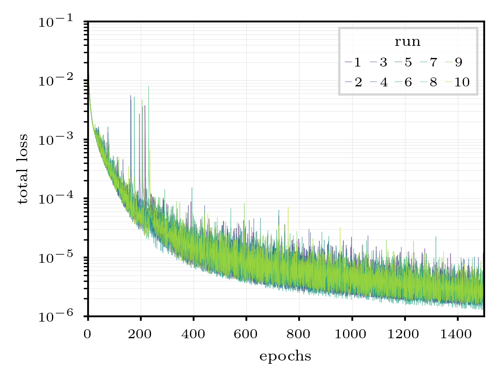</td>
      <td align="center">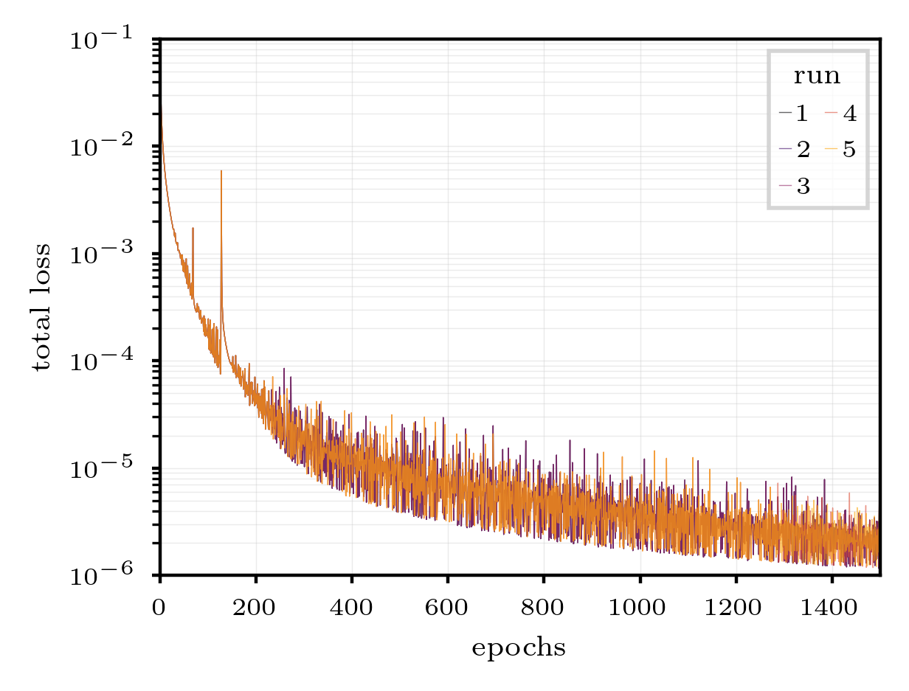</td>
    </tr>
    <tr style="background-color:#cff0fa">
      <td colspan="2" align="center">training loss ratio</td>
    </tr>
    <tr>
      <td align="center">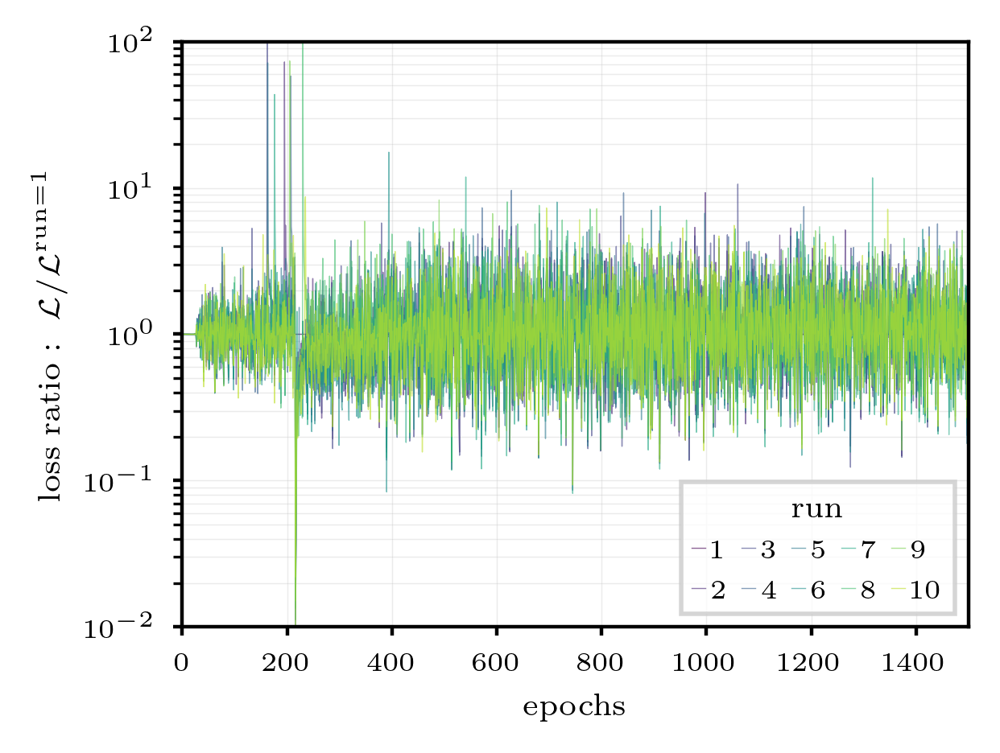</td>
      <td align="center">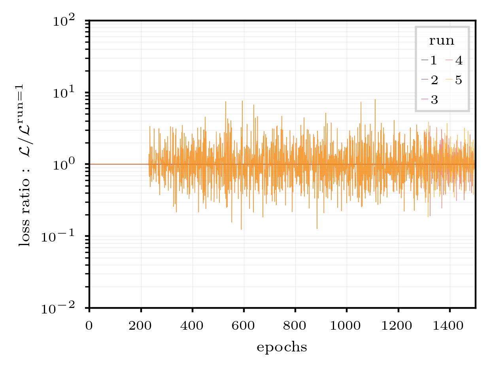</td>
    </tr>
  </tbody>
</table>

Sample of kernels
------------

Comparison of kernels evidentiate the variability observed among the runs. No trend or relationship could be found on which kernels were more or less modified among the different runs. Models trained with double precision are more uniform.

<table border="1" align="center">
  <thead>
    <tr>
      <th style="background-color:#82afbd" colspan="2" align="center">Least and most modified kernels</th>
    </tr>
  </thead>
  <tbody>
    <tr style="background-color:#a6e4f7">
      <td align="center"><em>single precision (FP32)</em></td><td align="center"><em>double precision (FP64)</em></td>
    </tr>
    <tr style="background-color:#cff0fa">
      <td colspan="2" align="center">least modified kernels</td>
    </tr>
    <tr>
      <td align="center">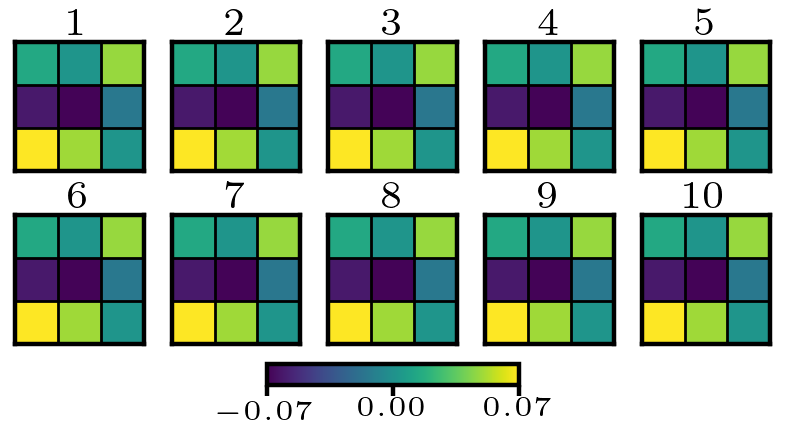</td>
      <td align="center">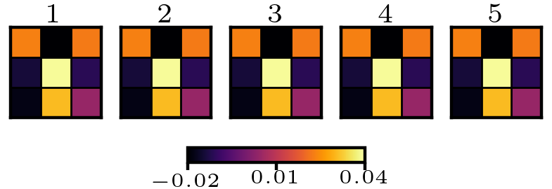</td>
    </tr>
    <tr style="background-color:#cff0fa">
      <td colspan="2" align="center">most modified kernels</td>
    </tr>
    <tr>
      <td align="center">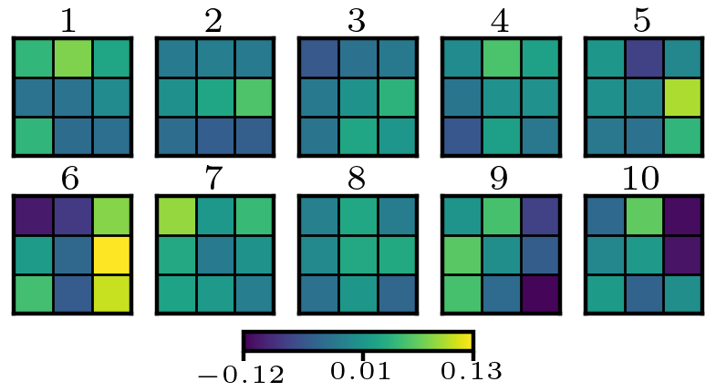</td>
      <td align="center">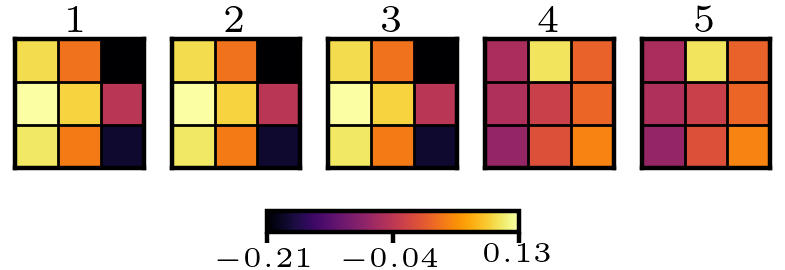</td>
    </tr>
  </tbody>
</table>

Samples of recurrent test results
------------

Examples of target, estimated and pixel-wise absolute error fields for the propagation of the Gaussian pulse benchmark are presented for single and double precision models. Best and worst runs, having the training loss as the criterion, are presented. The reference quantity ε = 0.001 is the starting pulse amplitude, in LBM units.

<table border="1" align="center">
  <thead>
    <tr>
      <th style="background-color:#82afbd" colspan="2" align="center">Recurrent test for best and worst runs, best models for each run</th>
    </tr>
  </thead>
  <tbody>
    <tr style="background-color:#a6e4f7">
      <td colspan="2" align="center"><em>single precision (FP32)</em></td>
    </tr>
    <tr style="background-color:#cff0fa">
      <td align="center">best (run 6)</td><td align="center">worst (run 3)</td>
    </tr>
    <tr>
      <td align="center">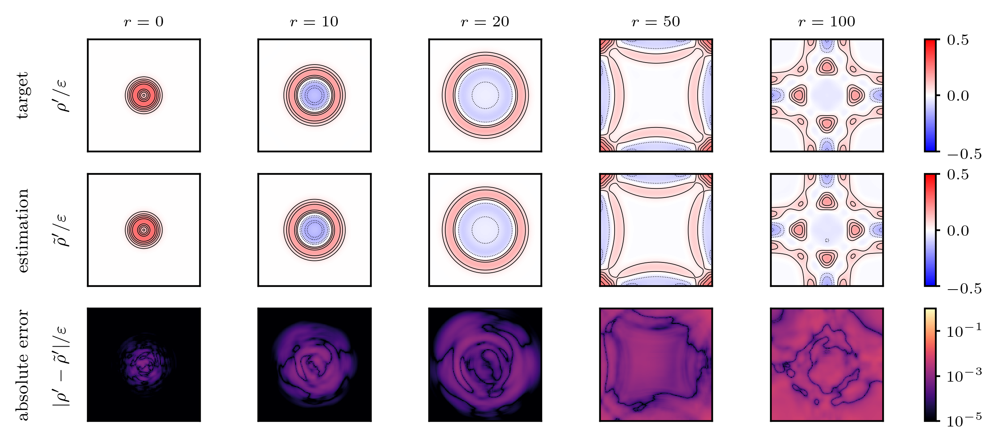</td>
      <td align="center">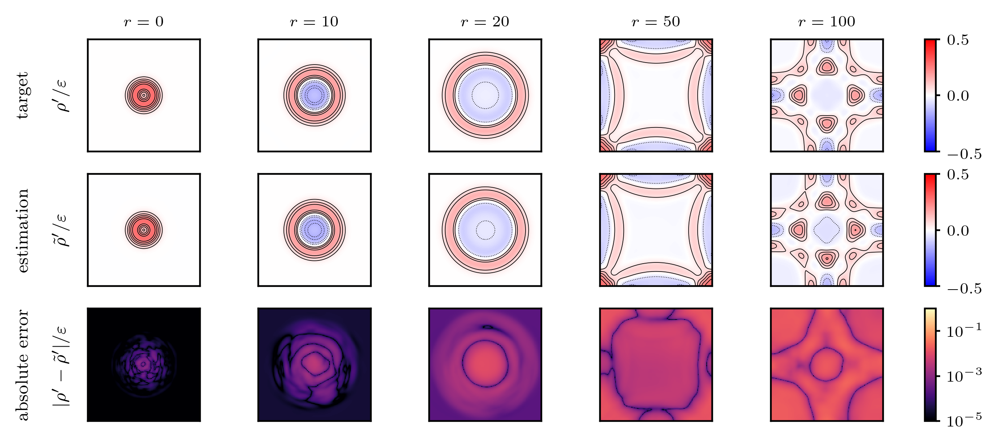</td>
    </tr>
    <tr style="background-color:#a6e4f7">
      <td colspan="2" align="center"><em>double precision (FP64)</em></td>
    </tr>
    <tr style="background-color:#cff0fa">
      <td align="center">best (run 4)</td><td align="center">worst (run 3)</td>
    </tr>
    <tr>
      <td align="center">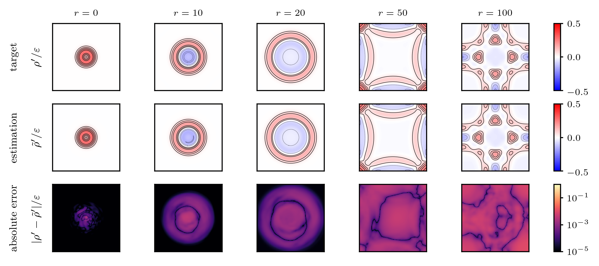</td>
      <td align="center">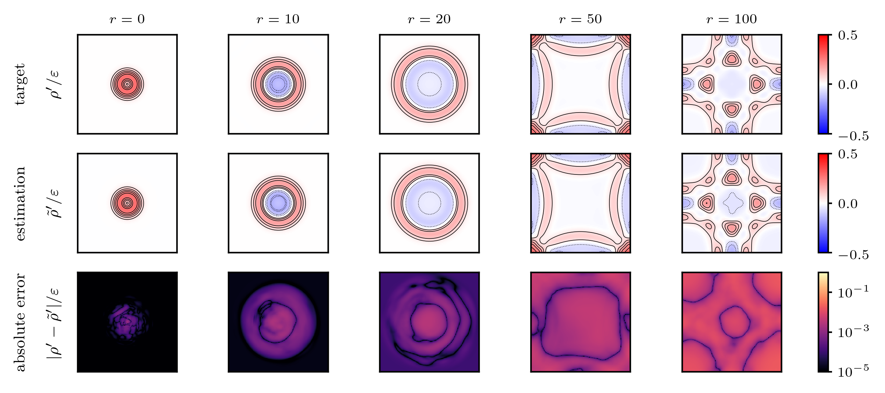</td>
    </tr>
  </tbody>
</table>

Samples of featured fields
------------

Examples of featured fields for the end of each scale (quarter, half and full) for all models trained with single and double precision are presented next. Models’ input datapoint are the first 4 frames of the Gaussian pulse benchmark. Single precision models vary in amplitude and shape, while similar fetures are seen in all fields for the double precision runs.

<table border="1" align="center">
  <thead>
    <tr>
      <th style="background-color:#82afbd" colspan="2" align="center">Featured fields for multiple runs, best models for each run</th>
    </tr>
  </thead>
  <tbody>
    <tr style="background-color:#a6e4f7">
      <td align="center"><em>single precision (FP32)</em></td>
      <td align="center"><em>double precision (FP64)</em></td>
    </tr>
    <tr style="background-color:#cff0fa">
      <td colspan="2" align="center">quarter scale</td>
    </tr>
    <tr>
      <td align="center">
      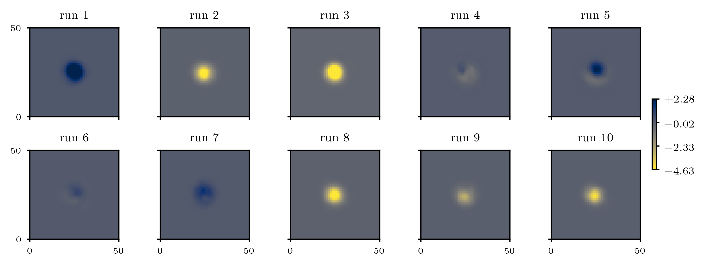
      </td>
      <td align="center">
      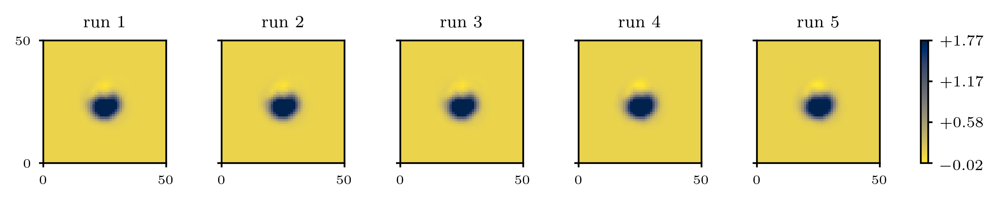
      </td>
    </tr>
    <tr style="background-color:#cff0fa">
      <td colspan="2" align="center">half scale</td>
    </tr>
    <tr>
      <td align="center">
      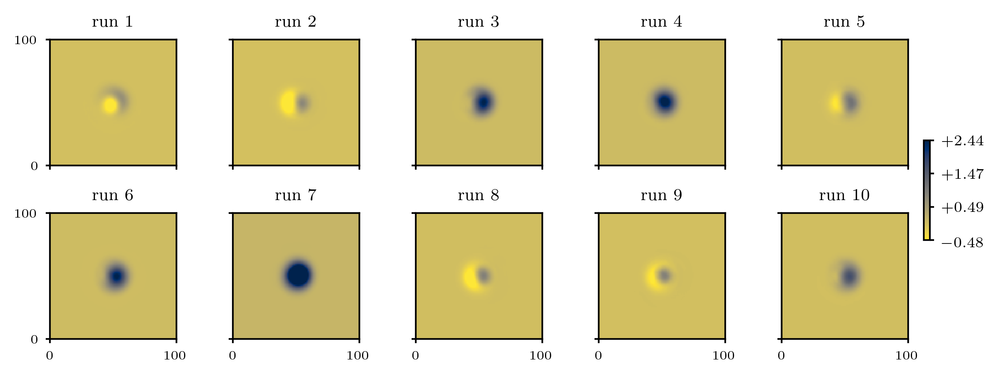
      </td>
      <td align="center">
      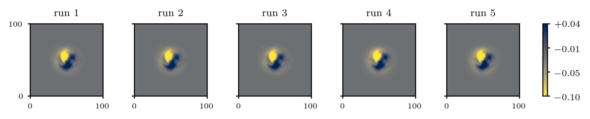
      </td>
    </tr>
    <tr style="background-color:#cff0fa">
      <td colspan="2" align="center">full scale (models' output)</td>
    </tr>
    <tr>
      <td align="center">
      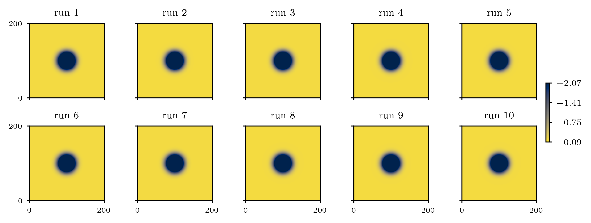
      </td>
      <td align="center">
      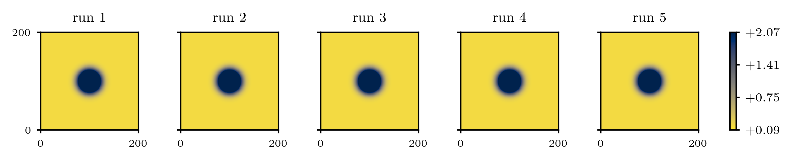
      </td>
    </tr>
  </tbody>
</table>

